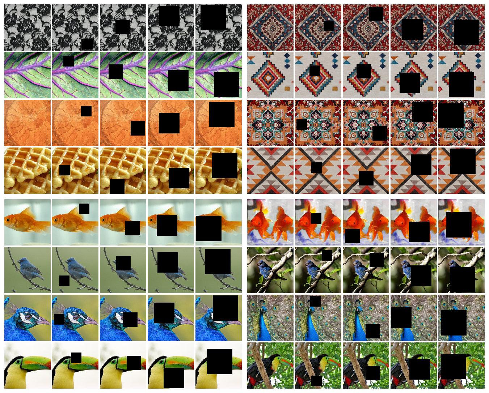
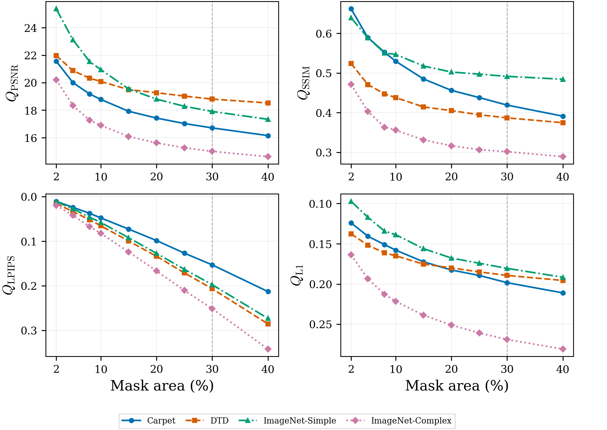
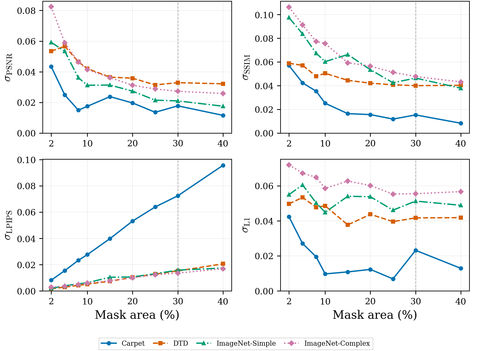

# How Mask Severity and Visual Domain Shape Image Inpainting Reconstructability


Code for controlled image inpainting reconstructability experiments across mask severity, visual domain, and reconstruction probe.

<div align="center">
  

  **Figure 1:** Representative block-mask corruptions across domains.
</div>

## Overview

Image inpainting fills missing regions from visible context, but fixed-mask evaluation can hide how reliability changes as corruption increases. This repository studies inpainting reconstructability as a function of mask severity, visual domain, and reconstruction probe. The experiments use three convolutional U-Net variants as probes and fixed block-mask severity grids across texture and natural-image domains.

The central goal is not only to ask which model scores best, but to measure when reconstruction is stable, when it degrades gradually, and when conclusions become architecture-sensitive.

## What This Repository Contains

- Training and evaluation code for `unet`, `partial_conv`, and `gated_conv` probes.
- Dataset configs for `carpet`, `dtd`, `imagenet`, `imagenet-simple`, and `imagenet-complex`.
- Mask generators for `block`, `multi_block`, `freeform`, and `mixed` corruptions.
- Versioned benchmark profiles for training and degradation evaluation.
- Scripts for figures, per-run plots, train/validation curves, and an interactive validation app.

## Method And Protocol

Let `I` be a clean image and `M` be a binary mask where `M_ij = 1` denotes a missing pixel. The observed image is:

```math
I_{\mathrm{obs}} = I \odot (1 - M)
```

Mask severity is the missing-area ratio:

```math
s(M) = \frac{1}{HW}\sum_{i=1}^{H}\sum_{j=1}^{W} M_{ij}
```

All paper probes are trained with masked-region L1 loss:

```math
L_{\mathrm{mask}} =
\frac{1}{\sum_i M_i}
\sum_i M_i |\hat{x}_i - x_i|
```

For metric `m`, probe `p`, domain `d`, geometry `g`, and severity `s`, the model-averaged degradation curve is:

```math
Q_m(d,g,s) =
\frac{1}{|P|}\sum_{p \in P} q_m(p,d,g,s)
```

Cross-probe dispersion is computed after orienting metrics so higher is better and min-max normalizing within each metric-domain pair:

```math
\sigma_m(d,g,s) =
\sqrt{
\frac{1}{|P|}
\sum_{p \in P}
\left(
\bar{q}_m(p,d,g,s) - \bar{Q}_m(d,g,s)
\right)^2
}
```

| Component | Setting |
|---|---|
| Input | `concat(I_obs, M)`, shape `4 x 256 x 256` |
| Output | RGB reconstruction, shape `3 x 256 x 256` |
| Probe models | `unet`, `partial_conv`, `gated_conv` |
| Domains | `carpet`, `dtd`, `imagenet-simple`, `imagenet-complex` |
| Training severities | `5`, `10`, `20`, `30` percent masked area |
| Evaluation severities | `2`, `5`, `8`, `10`, `15`, `20`, `25`, `30`, `40` percent masked area |
| Training budget | 80,000 optimization steps |
| Training loss | Masked-region L1 |
| Evaluation metrics | Masked-region L1, PSNR, SSIM, LPIPS |

## Results Preview

Model-averaged degradation curves summarize how reconstruction quality changes as the missing area grows. PSNR and SSIM are higher-is-better metrics, LPIPS and L1 are lower-is-better metrics and are inverted in the figure so higher vertical position consistently indicates better reconstruction.



Normalized cross-probe dispersion shows whether a condition is stable across probes or sensitive to the selected reconstruction architecture.



## Installation

Windows PowerShell:

```powershell
py -3.10 -m venv .venv
.venv\Scripts\Activate.ps1
python -m pip install --upgrade pip
pip install -r requirements.txt
```

Linux / macOS:

```bash
python3.10 -m venv .venv
source .venv/bin/activate
python -m pip install --upgrade pip
pip install -r requirements.txt
```

For the pinned environment:

```bash
pip install -r requirements.lock.txt
```

## Dataset Setup

Datasets are resolved from `DATA_PATH`.

Windows PowerShell:

```powershell
$env:DATA_PATH = "D:\datasets"
```

Linux / macOS:

```bash
export DATA_PATH=/data
```

Expected layouts:

| Dataset | Expected path |
|---|---|
| `carpet` | `%DATA_PATH%/carpet/images/{train,val}/{Cam_L,Cam_R}` |
| `dtd` | `%DATA_PATH%/dtd/images` and `%DATA_PATH%/dtd/labels/{train1,val1,test1}.txt` |
| `imagenet` | `%DATA_PATH%/imagenet/{train.X1,train.X2,train.X3,train.X4,val.X}` |
| `imagenet-simple` | `%DATA_PATH%/imagenet-simple/{train,val}` |
| `imagenet-complex` | `%DATA_PATH%/imagenet-complex/{train,val}` |

ImageNet-Simple and ImageNet-Complex are class-matched subsets produced by ranking ImageNet images with a visual-complexity score based on grayscale variance, Sobel edge magnitude, and edge density.

## Quick Start

Run commands from the repository root.

1. Install dependencies.
2. Set `DATA_PATH`.
3. Choose the workflow below: `Training`, `Evaluation`, or `Inference`.

## Training
Training fits one reconstruction probe on one visual domain. The paper-style runs use `benchmark_v1`, a fixed training profile with an 80,000-step budget, AdamW, cosine learning-rate schedule, masked-region L1 loss, validation every 2,000 steps, and best-checkpoint selection by validation loss.

**Start with a small sanity run:**

```bash
python train.py --dataset carpet --mask block --model unet --train sanity_cpu --batch_size 2 --limit 32
```

**Train one probe-domain configuration with block-mask severities:**

```bash
python train.py --dataset <dataset_key> --mask block --model <model_key> --train benchmark_v1
```

Example:

```bash
python train.py --dataset dtd --mask block --model gated_conv --train benchmark_v1
```

**Resume training from the latest checkpoint:**

```bash
python train.py --resume_ckpt runs/<train_run>/checkpoints/last.pt
```

Training outputs are written under:

```text
runs/<auto_run_name>/
├── checkpoints/
│   ├── best.pt
│   └── last.pt
├── metrics.csv
├── resolved_config.yaml
└── run_meta.json
```

## Evaluation

Evaluation is checkpoint-first: the model and config metadata are restored from the checkpoint. `degradation_v1` is the fixed block-mask evaluation profile used for the benchmark.

**Main command**

```bash
python eval.py --eval degradation_v1 --ckpt runs/<train_run>/checkpoints/best.pt
```

**Run a small evaluation pass without LPIPS:**

```bash
python eval.py --eval sanity_cpu --ckpt runs/<train_run>/checkpoints/last.pt --batch_size 2 --limit 16 --no_lpips
```

**Evaluate with full-image metric scope instead of masked-region metric scope:**

```bash
python eval.py --eval degradation_v1 --ckpt runs/<train_run>/checkpoints/best.pt --metric_scope full
```

Evaluation outputs are written under:

```text
runs/<train_run>/eval/<eval_profile>/<split>/epoch_<n>/eval_results.json
```

## Inference

For single-image inspection and qualitative inpainting results, use the interactive validation app:

```bash
python -m streamlit run tools/app.py
```

The app loads checkpoints from `runs/`, samples dataset images, applies masks, runs the selected reconstruction probe, and displays masked input, inpainting result, difference heatmap, crop zooms, and metrics.

## Figures

Regenerate the paper degradation and dispersion figures from discovered benchmark outputs:

```bash
python tools/plot_for_paper.py --out_dir figures/paper
```

Generate a per-run degradation plot:

```bash
python tools/plot_degradation.py \
  --results runs/<train_run>/eval/degradation_v1/val/epoch_<n>/eval_results.json
```

Plot train/validation curves:

```bash
python tools/plot_train_val.py --metrics runs/<train_run>/metrics.csv
```

## Project Layout

- `configs/` — dataset, loader, model, mask, training, and evaluation profiles  
- `data/` — dataset and dataloader implementations  
- `evaluation/` — evaluation grids and profile utilities  
- `figures/` — paper-ready figures and visualizations  
- `mask/` — mask generation utilities  
- `models/` — U-Net, partial convolution, and gated convolution probe models  
- `runs/` — checkpoints, metrics, configs, and evaluation outputs  
- `tools/` — plotting, demo, ImageNet subset, and application scripts  
- `training/` — training/evaluation loop helpers, checkpoints, losses, and optimizers  
- `utils/` — metrics, visualization, runtime, and configuration helpers  

## Troubleshooting

- `dataset_cfg.root is missing` or empty dataset:
  - Ensure `DATA_PATH` is set and dataset folders match expected layout.
- `Unsupported checkpoint format version`:
  - Checkpoint was created with older code; re-train or use a checkpoint from current code.
- `ImportError: lpips` during eval:
  - Install dependencies from `requirements.txt` (or run eval with `--no_lpips`).
- `ImportError: matplotlib` when plotting:
  - Install dependencies from `requirements.txt`.
